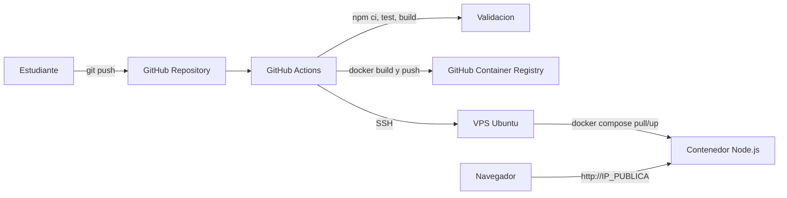

# CI/CD hacia una VPS

Proyecto demostrativo para la tarea de automatizacion operativa, control de cambios y despliegue moderno. La aplicacion es un servicio web pequeno en Node.js/TypeScript cuyo objetivo principal es evidenciar un flujo CI/CD funcional con GitHub Actions, Docker y una VPS.

## Arquitectura



Componentes principales:

| Componente | Funcion |
| --- | --- |
| GitHub | Repositorio publico y control de cambios. |
| GitHub Actions | Ejecuta validacion, construccion y despliegue. |
| GHCR | Guarda la imagen Docker generada por el pipeline. |
| VPS Ubuntu en Google Cloud | Servidor real donde corre la aplicacion con Docker Compose. |
| Aplicacion Node.js | Servicio HTTP con pagina principal, `/health` y `/api/pipeline`. |

## Flujo CI/CD implementado

El workflow esta en [`.github/workflows/deploy.yml`](.github/workflows/deploy.yml).

Cuando se abre un Pull Request hacia `main`, el pipeline ejecuta:

1. Instalacion de dependencias con `npm ci`.
2. Pruebas automaticas con `npm test`.
3. Compilacion TypeScript con `npm run build`.

Cuando se hace `push` a `main`, ademas ejecuta:

1. Construccion de imagen Docker.
2. Publicacion de la imagen en GitHub Container Registry.
3. Conexion SSH hacia la VPS.
4. Actualizacion del servicio con `docker compose pull` y `docker compose up -d`.
5. Smoke test contra `http://IP_DE_LA_VPS/health`.

## Endpoints de la aplicacion

| Ruta | Descripcion |
| --- | --- |
| `/` | Pagina HTML con estado del despliegue y etapas del pipeline. |
| `/health` | Healthcheck JSON usado por Docker y GitHub Actions. |
| `/api/pipeline` | JSON con las etapas del flujo CI/CD. |

## Ejecucion local

Requisitos:

- Node.js 22 o superior.
- npm.

```bash
npm install
npm test
npm run build
npm run dev
```

Abrir:

```text
http://localhost:3000
http://localhost:3000/health
http://localhost:3000/api/pipeline
```

## Ejecucion con Docker

```bash
docker build --build-arg GIT_SHA=local -t cicd-vps-admin-ti .
docker run --rm -p 3000:3000 cicd-vps-admin-ti
```

## Preparacion de la VPS

La guia completa esta en [`docs/vps-setup.md`](docs/vps-setup.md).

Resumen:

1. Crear una VPS Ubuntu en Google Cloud Compute Engine.
2. Abrir los puertos `22` y `80`.
3. Instalar Docker.
4. Crear usuario `deploy`.
5. Autorizar una llave SSH para GitHub Actions.
6. Configurar secretos en GitHub.

Secretos requeridos:

```text
SSH_HOST=34.30.111.245
SSH_USER=deploy
SSH_PRIVATE_KEY=llave_privada
SSH_PORT=22
```

## Evidencia para el video

El video debe mostrar:

1. La VPS creada o utilizada.
2. Docker instalado en la VPS.
3. La aplicacion funcionando en `http://IP_DE_LA_VPS`.
4. El repositorio publico en GitHub.
5. El archivo `.github/workflows/deploy.yml`.
6. Una ejecucion exitosa del pipeline.
7. La validacion, construccion y despliegue en los logs.
8. El resultado final funcionando en el servidor.

## Plantilla para documento PDF

El documento final debe incluir:

- Nombre completo.
- Descripcion breve de la arquitectura.
- Explicacion resumida del flujo CI/CD.
- Descripcion de la VPS y entorno de despliegue.
- Enlace al video en Google Drive con permisos de visualizacion.
- Enlace al repositorio publico de GitHub.

## Proveedores recomendados para VPS gratuita

Para esta implementacion se utilizo Google Cloud Compute Engine con una instancia `e2-micro`, Ubuntu y una IP publica externa. Como alternativas se puede usar Oracle Cloud Always Free o AWS Free Tier si se cuenta con disponibilidad y creditos.
